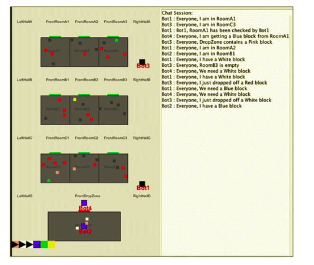
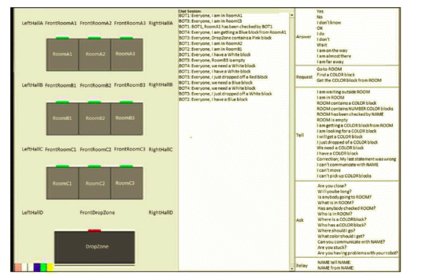
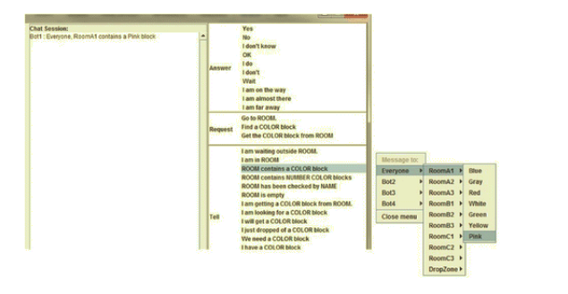
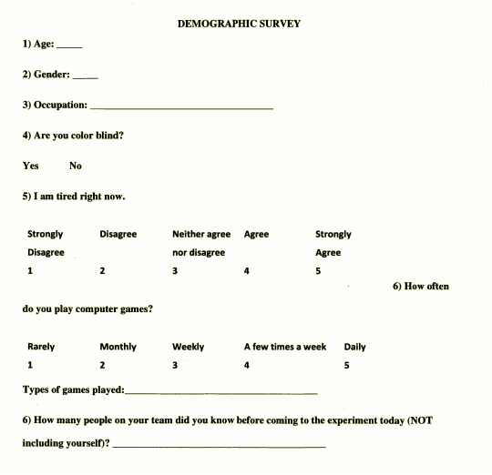
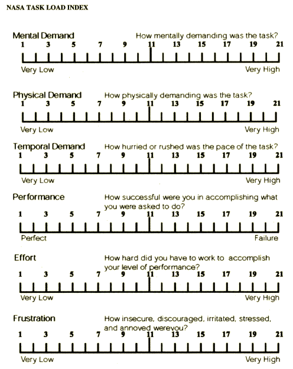
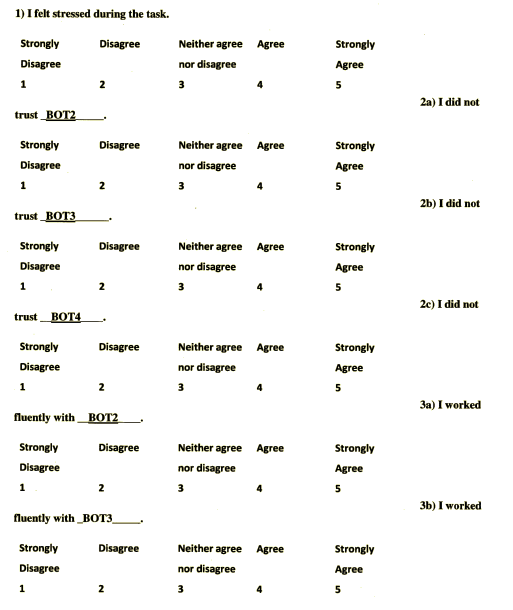
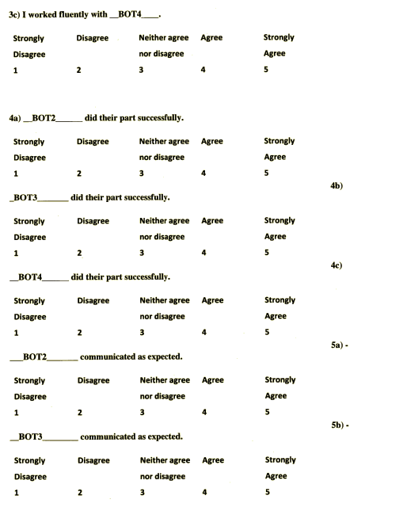
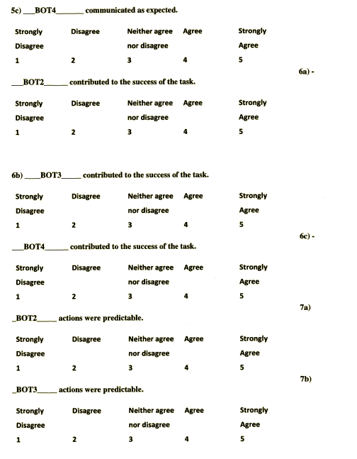
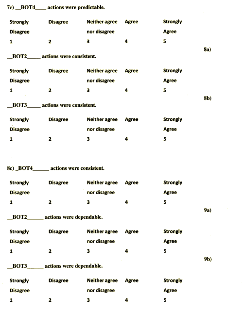
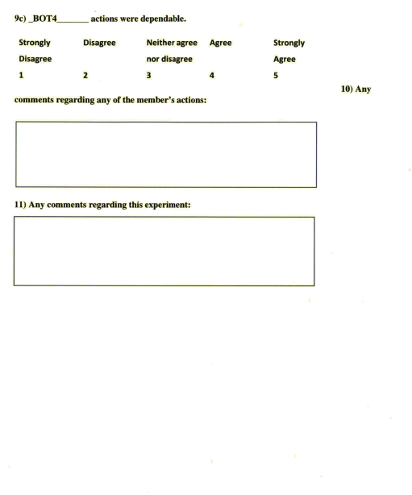

# Summary
This studied examined the communication among teams by having teams of four people search for and deliver a specified series of colored blocks as quickly as possible.

>Low-complexity task
>> Participants were required to collect six blue-colored blocks
>
>Medium-complexity task
>> Participants were required to search for and deliver 16 blocks, which were divided into two sequences that could be collected in parallel. One sequence called for pink- and green-colored blocks in alternating order, while the other required white and blue blocks in alternating order. Each of the four team members was assigned a specific color.
>> 
>> In one of the two medium-complexity tasks, it incorporated a “communication failure” in which two of the four agents were unable to communicate with each other for a prespecified duration within the task.
>>
>High-complexity task
>> Participants were required to collect six blocks in a random sequence of colors that was predetermined during the experiment design phase

# References
Main paper: https://journals-sagepub-com.proxy.library.upenn.edu/doi/10.1177/0018720816639712
Supplementary: file:///Users/katelynbottcher/Downloads/961321058-MIT.pdf

# Stimuli
## The visual components
>The environment contained nine rooms, designated A1 through C3, with each room containing colored blocks. A 10th room, designated the “drop zone,” was located at the bottom of the map. There were also hallways allowing the participants to travel from room to room.
>
>Each participant could only see the blocks in the room he or she was currently occupying, including the drop zone. Participants were also unable to see the locations of their teammates; however, when another agent was occupying an adjacent room, the door to that room was colored red; otherwise, it was colored green
>
>To communicate with each other the BW4T interface included a large chat window and a set of predetermined communications to facilitate this interaction: “Ask,” “Question,” “Tell,” and “Relay.” The participants then had to select who the message was for, whether it was about a room or a block, and then further describe it using the predetermined options.
>
>To know what was in the block zone the participants either had to visit the block zome or communicate to each other
>

>
>Questionnaires:

 

# Procedure
## Steps
> Each participant was given an introduction to the study, an informed
consent form first. Next, participants completed an initial survey to document participant
demographics
> 
> They were placed at computers with large boards between all four of them. They were asked to remain silent for the duration of the game.
>  
> They then received an introduction to the study, an informed consent form, and an overview of the BW4T display. 
> 
> They completed three training rounds, each which took about 10 minutes. Participants practiced variations of the low-, medium-, and high-complexity tasks.
> 
> Next, a total of four tasks were executed by the team: one low-complexity task, one high-complexity task, and two medium-complexity tasks. The order of the tasks was randomized
>>Participants then had to look below the drop zone to see the desired sequence of colored blocks. They then had to work together to deliver the specified colored blocks to the drop zone.
>>
>> If the participant delivered a block into the drop zone that was not of the requested color, this incorrect block was automatically and randomly placed into one of the other nine rooms.
>> 
>> After each task, a subjective questionnaire was administered in order to obtain feedback on participants’ perceived workload, stress, and degree of trust in their teammates.

## Roles 
>The experimenter's screen had an overview of all of the rooms

## Instructions
Instructions provided on the GitHub Page and adapted by CSS Lab: 

Thank you for participating in our experiment, we're going to give an overview on how to navigate the online game. 

When the GUI is open (Figure 3), two main parts can be seen:
1. left: the map area, where the map and the block sequence are being displayed.
2. right: the message area, where messages between bots and e-partner are being displayed.
The name of the bot that is controlled is shown in the title bar of the GUI.

Figure 3: Human Player GUI with map panel (left) and message panel (right).

General Use: 
To use the human player interface, you will click with the left (occasionally the right) mouse button in the GUI. Depending on where you click, different menus appear. You can then pick the appropriate action from the menu to execute that action. In the following sections the possibilities are explained.

 In the map area, the bot can be directed by clicking on the map. Different pop-up menus will appear upon clicking on different entities on the map.

In the message area, the remaining battery charge of the bot is shown in the top left. The combo box in the top center allows the user to select other bots, to which messages can be sent. The top right 'Choose message' button allows you to select a message to send. The text area in the center shows the previous messages that were communicated.

The map panel shares the message target with the message panel. So all messages that are sent from the map panel are sent using the actual message target setting in the message panel. A message will be sent to all bots by default. Please refer to the Message Panel section below to adjust the receiver(s) of messages.

Here the following actions can be done:
> Go to: "place": To command the bot to go to a room or a certain place in the corridors, click on the room or place where the bot needs to go to. The corridor menu will appear next to your mouse pointer with the option go to here or 
> Send message: I am waiting outside "room": To send a message to a bot or to all bots, click in the corridor. The corridor menu will appear next to your mouse pointer with the options I am waiting outside "room".
> Send message: I am in "room": To send a message to a bot or to all bots, click in the room. The room menu  will appear next to your mouse pointer with the option: I am in "room".
>  Send message: tell other bot(s) "information": To send a message to a bot or to all bots with certain information about a certain room, click on the room. The room menu will appear next to your mouse pointer with the messages you can send.
> Send message: tell other bot(s) about blocks: By clicking on a block (particularly, those below the drop zone), the user can tell a bot or all bots something about that block, or ask others for information about that block.
> Send message: ask other bot(s) "question" about certain room: To ask a bot or all bots a question about a certain room, click on the room. The room menu will appear next to your mouse pointer with the possible questions that can we asked.
> Pick up block: To pick up a "block", click on the block that needs to be picked up. The block menu (Figure 7) will appear next to your mouse pointer. Click on Go to color" block. When the controlled bot is standing on the block, click on the bot. The block menu when standing on block will appear. Click on Pick up "color" block.

> Drop block: To drop the block that is currently being held, click on the room in which it needs to be dropped. The room menu when holding block will appear next to your mouse pointer. This menu is almost identical to (Figure 6 but it has an extra item 'Put down block'). Click on Put down block. Do note that the controlled bot should be in
the same room as where you want to drop the block.
> Pick up e-partner: To pick up an e-partner, click on the e-partner that needs to be picked up. The e-partner menu will appear next to your mouse pointer. Click on Go to e 􀀀 partner. When the controlled bot is standing on the e-partner, click on the e-partner again. The e-partner menu when standing on e-partner will appear.  Click on Pick up e 􀀀 partner.
> Send message to e-partner: To send a message to the e-partner that is currently being held, click on the e-partner. The e-partner menu when holding e-partner will appear next to your mouse pointer. Click on I am going to "room". This option will only appear if the e-partner has GPS enabled.

> Drop e-partner: To drop the e-partner which is currently being held, click on the e-partner. The e-partner menu when holding e-partner will appear next to your mouse pointer. Click on Put down e 􀀀 partner.

Message Panel: 
The second choose message button will only be enabled when the bot is holding an e-partner. Below this button, the e-partner chat session will appear when the bot holds an e-partner for the first time. 
> Select message receiver To select who a message needs to be sent to, click on the dropdown box at Send message to :. The receiver is by default all. When set to all, all other bots receive the message. When set to a specic bot, only that bot receives the message.
> Send message to bot(s) To send a message, click on the Choose message button. A menu will appear next to your mouse pointer with the possible messages to be sent.

>Answer a question To answer questions asked by other bots, click in the bot chat session box. A menu will appear next to your mouse pointer with the possible answers to be sent.
> Send message to e-partner To send a message to the e-partner that is currently being held, click on the choose message button. A menu will appear next to your mouse pointer. Click on I am going to "room". This option will only appear if the e-partner has GPS enabled.
> Drop e-partner To drop the e-partner that is currently being held, click on the choose message button. A menu will appear next to your mouse pointer. Click on Drop e 􀀀 partner. The choose message button will be disabled after dropping the e-partner.

# Criteria
## Performance calculation
The team’s performance while completing the task was measured in terms of completion time. A low completiion time indicated high team performance. 

## Incentives
Each participant received a $10 monetary compensation for their participation in the experiment. An additional monetary incentive of $40 was provided for the team with fastest completion time across all performed tasks.
