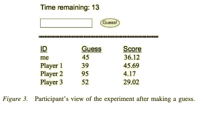

# Summary
This is a search task in which participants guess numbers between 0-100 and the computer tells them how many point were obtained from the guess. The participants were told their guess and scores as well as the guesses and scores of their neighbors so that the participants could choose to imitate high-scoring guesses from their peers.

# References
Main paper: https://www.researchgate.net/publication/23196347_Propagation_of_Innovations_in_Networked_Groups

Small World Network Structure: Ahmed E. & Abdusalam, H. A. (2000). On social percolation and small world network. European Physical Journal B, 15, 569-571. 

# Stimuli
## The visual components

# Procedure
## Steps
>Participants signed into a computer and gave themselves a handle or were assigned an ID
>> There were different network structures for each group of 10 participants (either a fully-connected network, small-world, or random network)
>
>Once all participants signed on, they received the instructions to the task
>
>Each problem consisted of 15 rounds in which participants had 20 seconds each round to guess a number between 0-100
>> When the round ended, the guesses were sent to a server which would calculate a score between 0-50, add normally-distributed noise with a variance of 25, and return the feedback.
>> 
>> The participants then began the next round knowing their guess and score as well as a list of their neighbor's guesses and scores
>> 
>> After the 15 rounds, the participants were given 15 seconds before the next problem began

## Roles 
>Each session had 20 participants and one experimenter

## Instructions
>Thank you for participating in this experiment on how ideas move from person to person in a social group. Your task is to try to accumulate as many points as possible. On each trial, you will type in a number between 0 and 100, and the computer will tell you how many points your number receives. There is a systematic relationship between the number you put in, and the points you receive, but the relationship will often be difficult for you to understand. Every time you type in the same number, it will be worth about the same number of points, but there may also be a bit of randomness added in to the earned points. Usually, numbers that are close to each other will receive similar points. At the end of each block of trials, you will be told how many points you earned, and how many points people earned in general.
>
>In addition to telling you how many points your guess was worth, after each round of guesses, the computer will show you what numbers other people guessed, and how many points those guesses earned. You can use this information to help you decide what number to guess on the next round. Other people will also see the number that you entered, and how many points you received.

# Criteria
## Performance calculation
>Performance was examined by how quickly group members found the best solution, the average proportion of participants guessing in the maximum, and the amount of bandwagoning in the various networks

## Incentives
> Participants receive partial course credit
