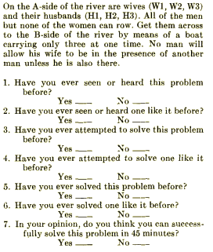

# Summary
>The primary object of the experiment was to estimate the effect of previous exposure to a problem not only on individual, but also on group performance, and thus evaluate how previous experience may influence the relation given by equation

# References
Main paper: https://onlinelibrary-wiley-com.proxy.library.upenn.edu/doi/pdfdirect/10.1002/bs.3830050103

# Stimuli
## The visual components
> The problem participants had to evaluate whether or not they could solve
> 

# Procedure
## Steps
> Randomly divide participants as individual or groups of either 3-4 or of 6-7.
> Participants received the Tartaglia transportation puzzle and answer six questions regarding the participants memory about previous experience with the problem, and was requested to estimate his ability to solve the problem within a 45-minute period.
> Participants were then instructed to solve the problem
 
## Instructions
Ask

# Criteria
## Performance calculation
> The data were classified by the "level of aspiration" and the extend of experience with a similar and/or the same problem

## Incentives
No incentives were mentioned
