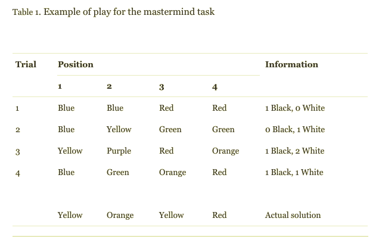

# Summary
Participants played the mastermind game, in which a possible color pattern is randomly designated as the correct answer. If a player selects a correct color in the correct position, they receive a black peg. If a player selects a correct color in the incorrect position, they receive a white peg. Thus, if a player receives 4 black pegs, they know they placed the 4 colors in the correct positions. The objective of the task is to identify the correct response in the fewest possible trials.

There were six conditions: four group conditions and two individual conditions. The participants were randomly assigned to each, and the group condition contained groups of three.

The easy conditions involved 4 sequential positions with 3 possible values (also represented by colors) and the difficult conditions involved 4 sequential positions with 6 possible values (typically represented by 6 different colors)

>Gen (Group/Easy problem/No ranking information)
>
>Gei (Group/Easy problem/Ranking information)
>
>Gdn (Group/Moderately difficult problem/No ranking information)
>
>Gdi (Group/Moderately difficult problem/Ranking information)
>
>Ie (Individual/Easy problem)
>
>Id (Individual/Moderately difficult problem).

# References
Main paper: https://www-sciencedirect-com.proxy.library.upenn.edu/science/article/pii/S0749597802000109?via%3Dihub

# Stimuli
## The visual components

# Procedure
## Steps
Individual Condition
1. Participants were sent to small individual rooms
2. Participants completed three administrations of the task individually
3. Steps 3 and 4 of the group condition are used here as well

Group condition
1. Participants used individual rooms during the individual administrations and were moved into another room when they worked as a group
2. Participants completed two administrations of the task individually, and the third administration of the task in a group
3. Problem-solvers had to solve each administration within the alloted eight trials
4. Those who did not solve the task within the eight trials were assigned a trials-to-solution score of 9 for that administration of the task.
5. Group members were ranked from first (highest performance on the individual administrations of the task) to third (lowest performance on the individual administrations of the task) based on the sum of their trials to solution on the two administrations of the task.
4. In the no ranking information condition, ranking information was not communicated to the participants. In the ranking information condition, each group member was either taken aside and individually told his or her rank within the group prior to the group administration of the task (individual) or the complete group ranking was announced in front of all members of the group simultaneously, prior to the group administration of the task (group). 
5. During the group test, the members of the group first recorded what they individually thought the solution to the Mastermind task was. The group then engaged in free discussion and chose one of the three solutions proposed by the group members (the group was not allowed to choose solutions not proposed by any group member). Then the group entered its choice and was given information regarding the fit of their proposed solution to the actual solution. This continued for 8 trials or until a correct solution was found.
6. The entire task had a one hour time limit

## Roles 
In the ranking information condition, all ranking information was verbally communicated by the experimenters directly to the participants

## Instructions
The object of this game is to guess the sequence of four colored pegs the computer has selected at random from the circled colors in the right field.

You start filling the holes at the bottom row with pegs, and each time you have completed a guess (i.e. filled all four holes) the computer will respond by giving you one peg for each correct color - black if your guess was also in the right place, otherwise white. (But you will not be informed about which colors were correct. That part you will have to figure out for yourself.)

If you haven't managed to guess the sequence by your 8th guess, the computer will reveal it to you and the game ends.

# Criteria
## Performance calculation
Performance was determined by a trials-to-solution score which was the number of trials it took to arrive at a correct solution.
If it took more the eight trials to arrive at a correct solution, a score of 9 was given. 

## Incentives
Students received course credit for participation
