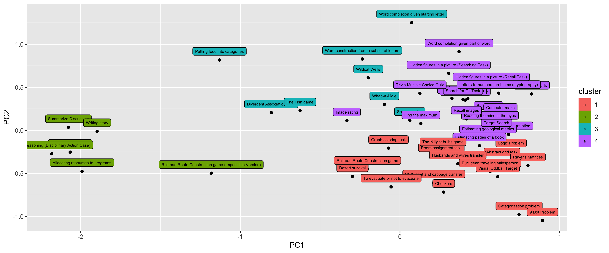

# Task Mapping
This page shows a map of the tasks invovled in the [group dynamics research focus](https://css.seas.upenn.edu/project/group-dynamics/) at the [Computational Social Science Lab at Penn](https://css.seas.upenn.edu), and provides a mechanism to download the data directly.

### The map

A PCA of the mapped tasks.

### The data
The Github repository can be found at [github.com/Watts-Lab/task-mapping](https://github.com/Watts-Lab/task-mapping), and core mapping results can be found in [`task_map.csv`](https://github.com/Watts-Lab/task-mapping/blob/master/task_map.csv). This data is frequently updated.  

### The team
This is the work of Emily Hu, Linnea Gandhi, Mark Whiting, Abdullah Almaatouq and Duncan Watts, with support from numerous others including research assistants at Penn as well as the labor of Amazon Mechanical Turk workers. Learn more about these people and the rest of the lab members [here](https://css.seas.upenn.edu/people/). 
