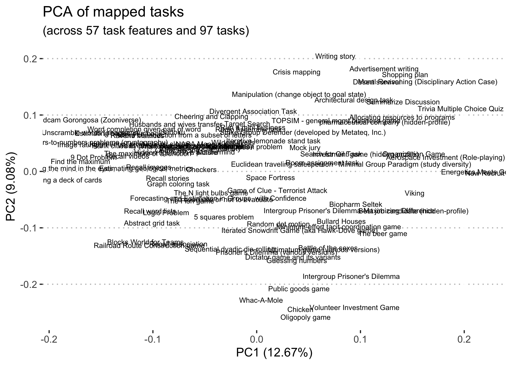

# Task mapping

In this repo, we are mapping tasks, mostly from the team performance literature. It involves two main steps: 

1. documenting tasks from research papers and other sources,
2. answering questions about the properties of the task, mostly drawn from existing team task taxonomies in the literature.

The process is driven by an [issue template](/.github/ISSUE_TEMPLATE/task-mapping-checklist.md) and a [template for the task documentation](task-template.md). The tasks that have already been mapped can be found in [`/tasks/`](/tasks). A subset of these are visualized below:

Contact [@markwhiting](https://github.com/markwhiting) with questions.