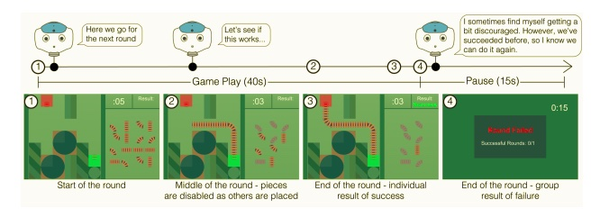

# Summary
> Three participants and a robot work together to create train track routes. 

# References
> Main article: https://www.pnas.org/content/117/12/6370.short
> > Supporting article: https://www.pnas.org/content/pnas/suppl/2020/03/03/1910402117.DCSupplemental/pnas.1910402117.sapp.pdf

## The visual components
> The participants were shown a board on their individual tablets and a bank of railroad pieces on the left side of the screen.
> As participants placed pieces on the board, a piece from the bank of pieces was greyed out so that piece could no longer be selected.

> Utterances in the neutral and vulnerable conditions were shown as if they were spoken by the robot after each player had completed their track and the team was shown their overall
score (whether or not they successfully completed that round).

## Materials for alternative versions of the experiment 
> The task was preprogrammed to win or lose a certain set of rounds.
> On rounds programmed to lose, the final necessary piece of track was not available to the human during that round.

# Procedure
## Steps
> Participants are given consent form and a preexperiment survey upon arrival.
> They are taken into the experiment room, where they sat in a pre-determined layout facing a small table, the other participants, and the robot, named Echo
> They are told they would be playing a game, as a group, along with the robot. The game is to be described as "created for kindergarten-aged children" and should be shown a high score board.
> They then begin the game tutorial on their personal tablet. The tutorial had two levels: level one allowing them to create a train track route without a time contraint, and level two with a time contraint. 
> There were 30 rounds in which players had to complete, and were preprogrammed in the following order:
> > 7 winning rounds, 10 rounds (6 wins and 4 loses) wherein each participant (including Echo) made one mistake, an additional 10 rounds where each participant (including Echo) made another mistake, and 3 final winning rounds
> At the end of the rounds, the robot says "goodbye" and the participants fill out a postsurvey. 

## Roles 
> A description of roles if relevant to the task.  
> If relevant, describe how roles are assigned and used in the task. List all roles and list how the experience for each role differs from others.

## Instructions
> Complete instructions shown to participants at each stage of the task.  
> Write the complete instructions used from the start to the end of the experiment. This should include any instruction provided on each of the steps. If instructions have step interdependence, or are role specific, describe that in full detail.

# Criteria
## Performance calculation
> The group’s score was the total number of successfully completed rounds for that group.

## Incentives
> No incentive mentioned
