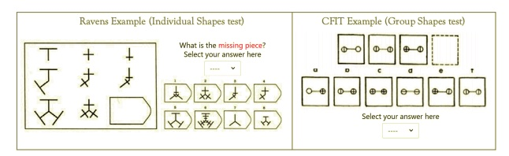

# Summary
> A series of tasks worked to identify individual contributions to group performance to determine "team players." Once the team player was found, most tasks ensued to determine how "team players" improve group performance. The Ravens Task in specific measured pattern recognition and spatial reasoning. This contributes to the study of IQ or liquid intelligence. 

# References
> Main paper: https://www.nber.org/system/files/working_papers/w27071/w27071.pdf
> > Supporting paper: Raven, J. (2003). Raven’s Advanced Progressive Matrices, Test Books 1 and 2: Pearson Assessment.

# Stimuli
## The visual components
> Raven's matrices involve determining the missing element in a pattern which is generally presented in the form of a matrix.
> In the advanced form of the matrices, items are presented in black on a white background similar to the standard version, and also becomes increasingly difficult throughout the test. 
> 

## Materials for alternative versions of the experiment 
>  Raven’s Advanced Progressive Matrices was used for the task of the individual, but for the group task a very similar test called the Culture Fair Intelligence Test was used.
> In the group phase, all members gathered around a single laptop and collectively decided on an answer for each item.

# Procedure
## Steps
> Have participants complete 14 Ravens items (even numbered items, ranging in difficulty from across sets I and II) in seven minutes 

## Roles 
> All individual participants had the same role.

## Instructions
> Participants are asked to look for a pattern and determine ‘what comes next’. Participants were asked to find the missing element (from options
a to f). 

# Criteria
>  Points are given to each item where the next element in the pattern is determined correctly.

## Performance calculation
> No incentives were mentioned
