# Summary
Participants had to assign students to rooms to maximize student utility.

# References
> Main paper: https://psyarxiv.com/ra9qy/

# Stimuli
## The visual components
> RME test
> 

>
> Phase 1 Stimuli
>
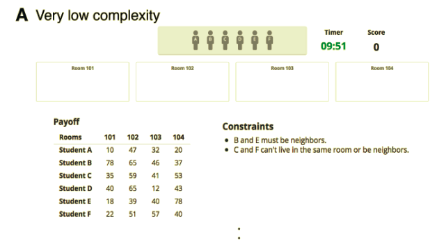
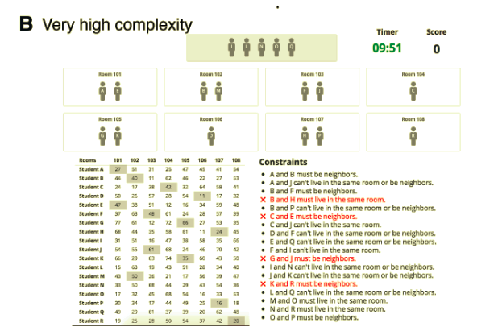
>
> Phase 1 Exit Survey
> 
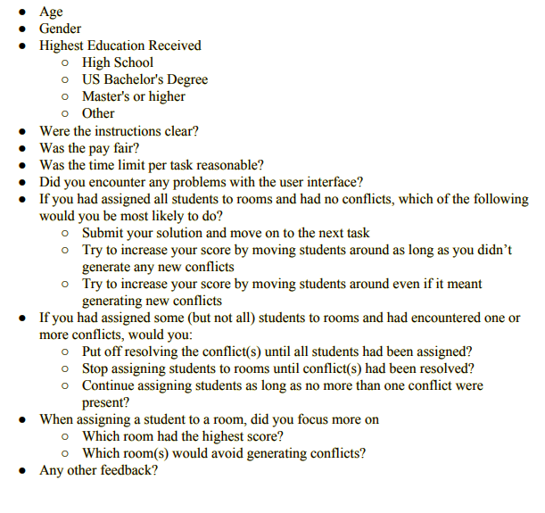
>
> Phase 2 Group Stimuli
>
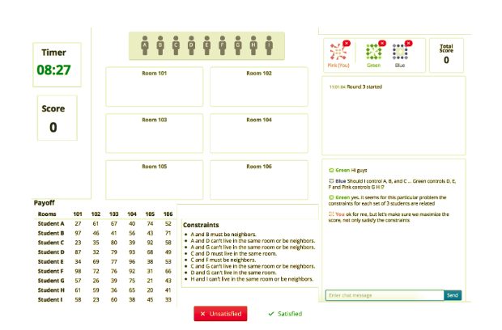
>
> Phase 2 Exit Survey
> 
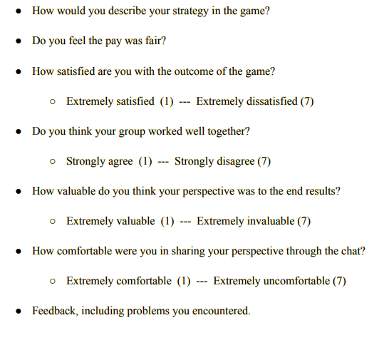

# Procedure
## Steps
> Phase One:
> > 1200 participants completed 5 room tasks (three “ very low” and two “moderate” complexity tasks) and a standard “Reading the Mind in the Eyes” (RME) test.
> > > The task required to assign N “students” to M “rooms” so as to maximize the total utility of the students, each of who has a specified utility for each room, while also respecting Q constraints.
> > > 
> > > The complexity of the task is characterized by the different number of students to be assigned (N), the number of dorm rooms available (M), and the number of constraints (Q). 
> > > 
> > > In each room assignment problem, a “utility table” was presented, providing participant(s) with the information on students’ ratings/preferences (between 0 and 100) to each of the M rooms indicating how satisfied they would be if being assigned to the room.
> > > 
> > >  At any time during the allotted 5-minute period for a task, the participant could push a button to submit her solution and move on to the next task, or the participant would be automatically redirected to the next task when the 5-minute timer was up
> > > 
> Phase Two: 828 of the original 1200 participants completed 5 more room tasks varying in very low, low, moderate, high, and very high complexity, with all tasks timing out at 10 mins. 
> > > Based on each individual's score in task one, they were categorized into blocks by skill level and social perceptiveness (HH, MH, LH, HL, ML, LL) 
> > > 
> > > Within these categories, the participants were then separated either into groups, or remained individual.
> > > 
> > > To avoid conflicts, when one group member was moving a student icon, that particular student icon was “locked” and other group members could not move it until it was released. We provided a chatbox on the task interface, enabling group members to communicate freely with each other during the tasks. All group members had to agree on the placements before moving on, or the task would continue automatically after 10 minutes.

## Roles 
> Phase two groups were categorized into blocks (HH, MH, LH, HL, ML, LL)
> HH: High skill, high social perceptiveness
>  
> MH: Mixed high/low skill, high social perceptiveness
> 
> LH: Low skill, high social perceptiveness
> 
> HL: High skill, low social perceptiveness
> 
> ML: Mixed high/low skill, low social perceptiveness
> 
> LL: Low skill, low social perceptiveness

## Instructions
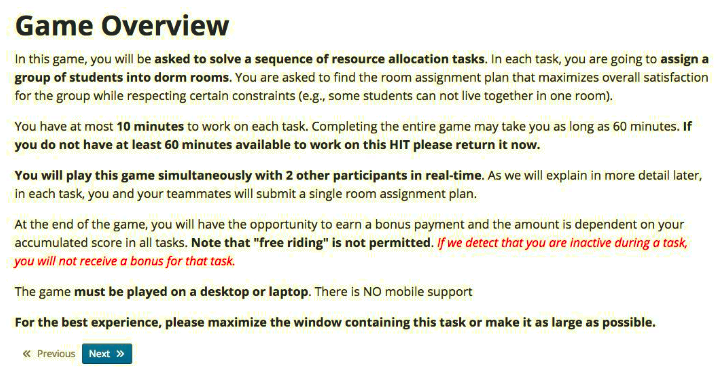
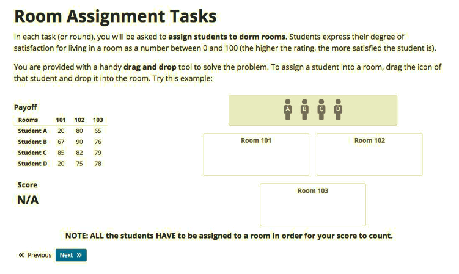
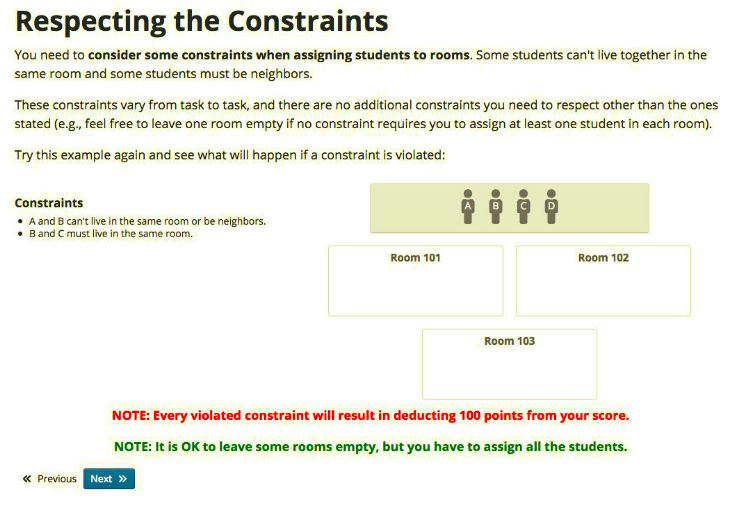
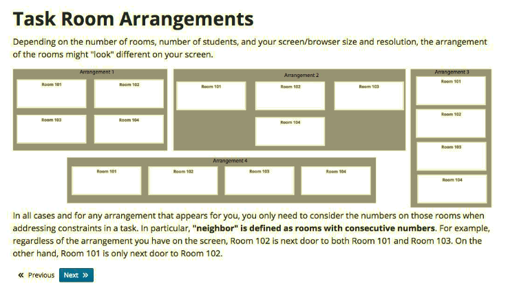
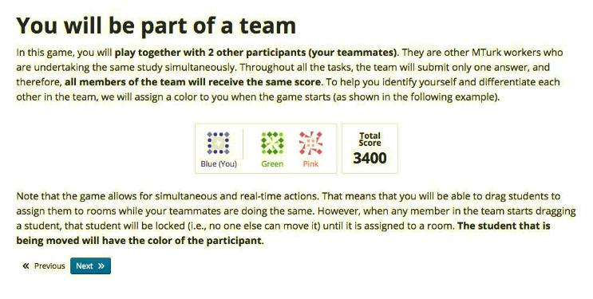
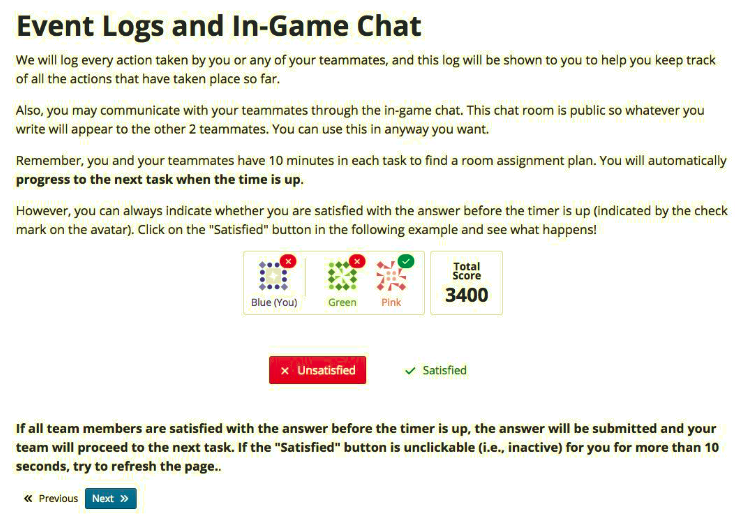
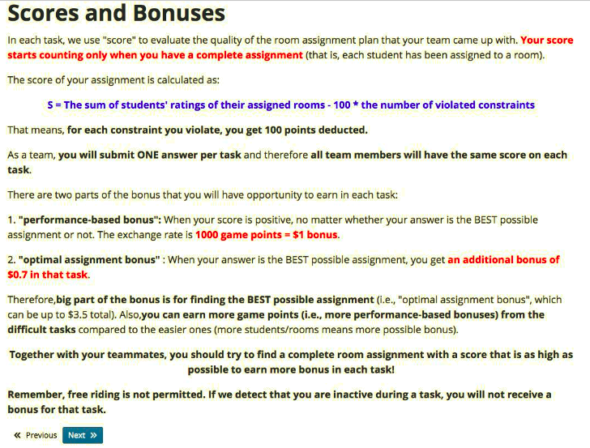
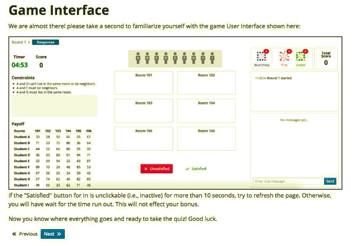
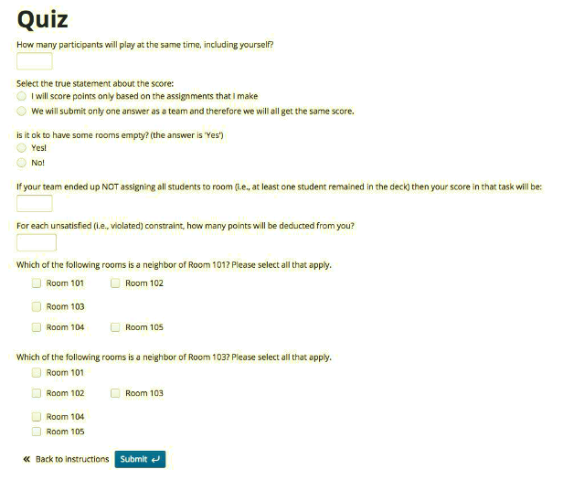

# Criteria
## Performance calculation
> Phase One:
> > Performance was calculated by looking at skill, social perceptiveness, and cognitive style.
> > > Skill was defined as the sum of the scores the participant achieved in the moderately complex tasks. The score a participant earned in a room assignment task considers both the total utility of students decided by rooms they were assigned and penalties caused by violations of any constraints. Individuals who scored above/below the median skill score were classified as high/low skill, respectively.
> > > 
> > > Social perceptiveness was defined as the number of RME questions correctly answered. As with skill, individuals above/below the median social perceptiveness score were classified as high/low social perceptiveness, respectively.
> > > 
> > > Cognitive style was defined by:
> > > > Speed (“tortoises” vs. “hares”)
> > > > 
> > > > Preference for efficiency vs. perfection (“pragmatist” vs. “perfectionist”)
> > > > 
> > > > Tolerance for constraint violation (low vs. high)
> > > > 
> > > > Preference for optimization vs. constraint resolution (“optimizer” vs. “resolver”): if the participant assigned students then worked out conflicts they were in the "optimize first" category, and if they worked out conflicts before moving on to assigning more students then they were in the "satisfy first" category.
>
> Phase Two:
> > Performance was calculated by considering the normalized score the individual or group obtained on this task, defined as score on task T/ max score for task T.
> > 
> > Duration (or time to completion) was measured as the time elapsed from the start of the task until a solution is submitted
> > 
> > Efficiency was measured as normalized score/ duration.

## Incentives
> Overall scores were defined as the sum of students’ ratings of their assigned rooms - 100 * the number of violated constraints
> 
> If each student got assigned to one room and the participant had a positive score, participant(s) could earn a “performance-based bonus” using a 500 points:$1 USD conversion rate in phase one, and a 1000 points:$1 USD conversion rate in phase two. 
> 
> If the submitted plan was indeed the optimal one, an additional $0.5 USD “optimal assignment bonus” would be given.
