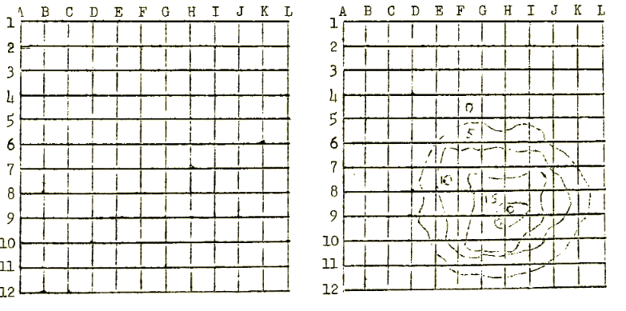
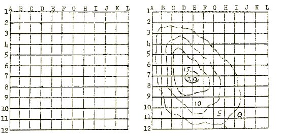
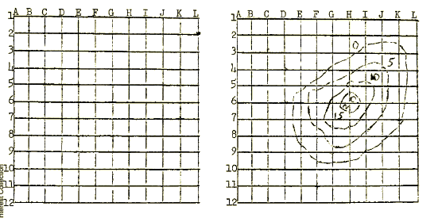
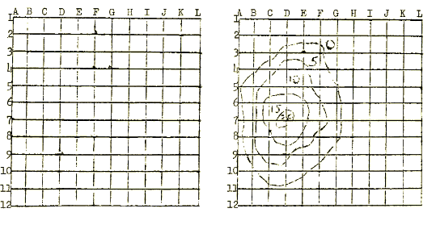

# Summary
Group members collectively guess coordinates, and the value of the experimenters diagram determines the value of their decision. 

# References
Main Paper: http://collections.uakron.edu/digital/collection/p15960coll1/id/21257/

# Stimuli
## The visual components

## Materials for alternative versions of the experiment 

# Procedure
## Steps
>The group is given a blank diagram with letters on the x-axis and numbers on the y-axis.
>
>Participants are read the instructions.
>
>Paricipants will be given 3 minutes for discussion before making a group decision, then will have 10 trials to choose a coordinate.
>
>After each decision, they will be told their score based on the diagram.
>
>The highest possible score would be a score of 200, where the group chooses the central coordinate on all 10 trials.

## Roles 
The group has a blank diagram, while the experimenter has a diagram with target values written in. The experimenter uses this diagram to report scores to the group.

## Instructions
"This is a kind of search task. On each trial, you will choose one of the coordinates on this chart, e.g., D-5, E-10, etc. For each problem, I will have a chart with concentric, irregular line drawn on it. The value of your decision will be determined by the value of this diagram. For example, if you choose D-3, this coordinate is outside the largest circle and has a value of zero; if you choose a coordinate between the largest and next largest circle, you get a value of 5, etc. The object is to earn as high a score as possible on the 10 trials allowed on each problem. After each decision, I will tell you the score you have earned according to my diagram. At first, of course, you will have no basis for making a choice. However, after a few trials, you should begin to learn something about the diagram that I have, and this beable to make more intelligent decisions.

The decision must be a group decision. You will be allowed three minutes for discussion in making each decision. If you wish you may choose the same coordinate on successive trials. You may also mark your decisions and their value on the diagram, if you wish."

# Criteria
## Performance calculation
Total score on 10 trials; number of trials to discover coordinate having highest value.

## Incentives
None mentioned
