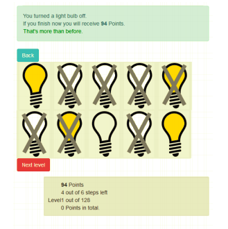

# Summary
The study compared two instances of such methods for solving multi-dimensional problems: (1) transmission chains, where individuals tackle the problem one after the other, each one building on the solution of the predecessor and (2) groups of independent solvers, where individuals tackle the problem independently, and the best solution found in the group is selected afterwards by tasking individuals to manipulate lightbulbs to find the best solution in the landscape.
# References
Main paper: https://www.nature.com/articles/s41598-020-59946-9.pdf

Data: https://github.com/cuehs/transmissionchains_independentsolvers

Supplemental paper: https://static-content.springer.com/esm/art%3A10.1038%2Fs41598-020-59946-9/MediaObjects/41598_2020_59946_MOESM1_ESM.pdf

# Stimuli
## The visual components
>The search environment for the participants was an NK-model in which the N represented the number of binary dimensions (which was fixed at 10) and K represented varying levels of ruggedness.
>>The 10 dimensions of the landscape were represented as 10 light bulbs that could be either on or off
>>

## Materials for alternative versions of the experiment 
There were eight conditions that consisted of smooth and rugged landscapes (K=1 or K=8), low or high individual's degrees of freedom (DoF=3 or DoF=6) and transmission chain or independent group.

>For the transmission chains, individuals search sequentially, one individual after another, each
one starting from the last position of her predecessor. 
>> The collective solution is then given by the last person’s final
position in the landscape.

>For independent solvers, all individuals start at the same initial position and search
in parallel without interactions.
>>The collective solution is then given by the best final solution of all individuals.

# Procedure
## Steps
>Participants were instructed to search for the best possible solution in a NK-landscape.
>
>>To facilitate the visual representation, 10 lightbulbs represented the 10 dimensions of the landscape and could be turned either on or off
>>Not all light bulbs could be manipulated, since the individual's degrees of freedom varied which allowed only a limited number of randomly selected dimensions to be manipulated
>>
>In each round, the participant could change the state of one light bulb
>
>After their decision, they were informed about their new payoff (all payofs were multiplied by 1,000) and were allowed to return to their previous solution before a new round started
>
>The duration of the search is set to 16 consecutive decisions
>
>Each participant played a total of 128 levels (16 landscapes per the 8 experimental conditions)

## Instructions
ASK

# Criteria
## Performance calculation
Payoffs in each landscape were normalized by dividing them by the maximal achievable payoff and using a monotonic transformation to raise each payoff to the power of eight
> Each participants payoff is determined by which manipulations correspond to the underlying NK-landscapes

## Incentives
Participants received a flat fee of 8€ plus a monetary bonus based on their total performance (0.16 € per 1000 points, mean bonus = 6.65 €, SD = 1.11€)
