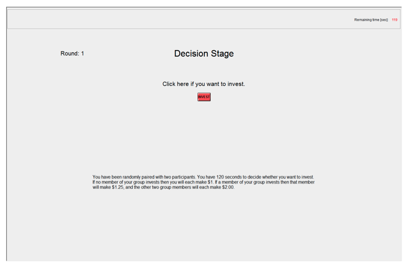

# Summary
> The volunteer investment game is a group task where participants make a decision that makes everyone better off but at a personal cost. No investment is the worst outcome, and the best outcome is someone else investing. 

# References
> Babcock, L., Recalde, M. P., Vesterlund, L., & Weingart, L. (2017). Gender differences in accepting and receiving requests for tasks with low promotability. American Economic Review, 107(3), 714-47.
>
>  Paper: https://pubs.aeaweb.org/doi/pdfplus/10.1257/aer.20141734
> 
> Appendix with instructions: https://www.aeaweb.org/content/file?id=7448

# Stimuli
## The visual components
> 

## Materials for alternative versions of the experiment 
> This paper includes five similar experiments with varying complexity, I can include information for all of them, but am unsure if it would make this make this file so long it is no longer useful.

# Procedure
## Steps
> In each of ten rounds participants are randomly and anonymously assigned to groups of three. Members of the group are then given two minutes to make an investment (volunteering) decision. Individual earnings are $1 in the event that no one invests before the end of the two minutes. If one group member makes the investment, the round ends, and the individual making the investment secures a payment of $1.25, while the other two group members each receive $2. The investor is randomly determined in the event that multiple parties simultaneously invest.

## Roles 
> No roles.

## Instructions
>Summary of instructions
> 1. In each round you are randomly paired with two other people in this room. You are never paired with the same person twice in a row.
>2. A round lasts 120 seconds.
>3. During each round you and your group members may invest in the group account. If no one invests you and the two other group members each earn $1 for the round. If one person invests then that
person earns $1.25 and the other two group members each earn $2.
>4. The round ends once someone invests or when the 120 seconds are up
Please raise your hand if you have any questions before we begin.
>
>Full instructions
>Introduction
>
>Thank you for participating in our study. This is an experiment about decision making. The other people in this room are also participating in the experiment. You must not talk to them or communicate with them in any way. If you have a question please raise your hand and one of us will come to where you are sitting to answer it.
>
>The experiment consists of ten rounds. In each round you are randomly paired with two other participants to form a group. You will never be paired with the same participant twice in a row. Your decisions are anonymous; no one will be able to determine which decisions were made by you. Your round earnings depend on the decisions made by you and by your group members. At the end of the experiment you will be paid, in private and in cash. Your total earnings will equal the sum of your earnings from the ten rounds plus $6 for showing up to the experiment.
Decisions
>
>In each round you and the two other group members will have an opportunity to invest in a group account. You and your group members will have 120 seconds to individually decide whether you want to invest in the group account. The round ends when the 120 seconds are up or when the first group member invests in the group account.
Earnings
>
>If no investment is made in the group account, all members of the group will earn $1 for the round. If one group member invests in the group account before the 120 seconds are up, then that individual earns $1.25 for the round and the other two group members each earn $2 for the round. If two group members simultaneously decide to invest, then it is randomly determined which of the two earns $1.25 versus $2 for the round.
Decision Screen
>Below you can see a screen shot of the decision screen you will be given to make your investment decision. Listed in the upper right corner is the number of seconds that remain of a round. To the left you can see the round number. The red button in the center of the screen is used to make your investment decision. Please click this button if you wish to invest. The round ends and the decision screen disappears as soon as you or a member of your group invests in the group account.

# Criteria
## Performance calculation
> Performance is based on a participant’s decision to invest or not invest. If a participant invests, they earn $1.25 and the rest of the group earns $2. If no one in the round invests, each person earns only one dollar. 

## Incentives
> There is a clear incentive to wait for another player to invest. Payments are made in cash at the end of the experiment and based on earnings throughout the experiment plus a $6 showing up fee.
