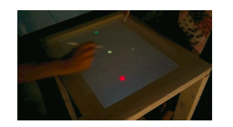
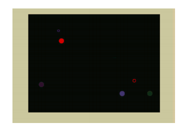

# Summary
> A task to show that imitation exists in competitive settings. Players were required to hit targets on a large visual touchscreen before their competitors.

# References
> Main paper: https://www.pnas.org/content/pnas/110/50/20046.full.pdf
> 
> Supporting paper: https://www.pnas.org/content/pnas/suppl/2013/11/20/1305996110.DCSupplemental/pnas.201305996SI.pdf
> 
> Movie 1: http://www.pnas.org/lookup/suppl/doi:10.1073/pnas.1305996110/-/DCSupplemental/sm01.wmv
> 
> Movie 2: http://www.pnas.org/lookup/suppl/doi:10.1073/pnas.1305996110/-/DCSupplemental/sm02.wmv 

# Stimuli
## The visual components
> Players used a “rod” to reach for targets (green and yellow) that were briefly shown among distracters (red, magenta, blue, and purple) on a large touch screen
> 
> 
> 
> 
> The open circle shows the rod on the screen.
> 
> Listed below is the meaning of each target and the x/y color–space coordinates according to the International Committee on Illumination 
> 
> Green: Player gained a point;  22.3 cd/m2, 0.186/0.760
> 
> Yellow: Opponent lost a point; 22.6 cd/m2, 0.340/0.545
> 
> Red: Player lost a point; 6.64 cd/m2, 0.621/0.322
> 
> Magenta: Opponent gained a point; 6.32 cd/m2, 0.314/0.131
> 
> Blue: Added to both players; 5.49 cd/m2, 0.167/0.121
> 
> Purple: Removed from both players; 5.22 cd/m2, 0.213/0.135

## Materials for alternative versions of the experiment 
> Players played 30 different variations of the game.
> 
> Experiment Two: A male confederate played 4 blocks of 4 whac-a-mole games (4 × 4 = 16 games) against 20 separate players. The confederate was instructed to be slow in blocks 1 and 3 and fast in blocks 2 and 4 and to only hit correct (i.e., yellow or green) targets. Researchers did not dissociate between reward and punishment of opponents, and players could only affect their own score when hitting a target.
Experiment Three: New participants played four blocks against a computer. The actions of the computer opponent were based on the confederate’s behavior of a selected experimental session in experiment 2. The player’s wins and losses were scored according to whether he or she hit the targets before the invisible confederate

# Procedure
## Steps
> Participants were paired to stand on either side of a large screen each holding a rod
> 
> They were instructed to hit the green and yellow targets on the screen as they appeared. They would accumulate points for each correct target they hit.
> 
> Participants played 30 Whac-A-Mole games that each lasted 40 seconds. They were allowed to take breaks between rounds

## Roles 
> In Experiment Two: a confederate was instructed to adjust its behavior across blocks. The confederate was instructed to act as a slow player in block 1 (games 1-4) and block 3 (games 9–12) and act as a fast player in block 2 (games 5–8) and block 4 (games 13–16).

## Instructions
> Players were instructed to hold the chopstick like a pen and not to talk during the games. 
> 
> They were instructed neither to block their opponent nor to place the stick on the table and slide from target to target without lifting the stick

# Criteria
## Performance calculation
> An open circle was used to represent the location of the rod on the screen, and the closed circles represented the targets. When the open circle overlapped a closed circle there was immediate feedback shown by either a green square or red square if the participant won or lost a point respectively.

## Incentives
> Players received a reward of 80 cents when they had won a game, 40 cents for a draw, and no extra reward if lost.
