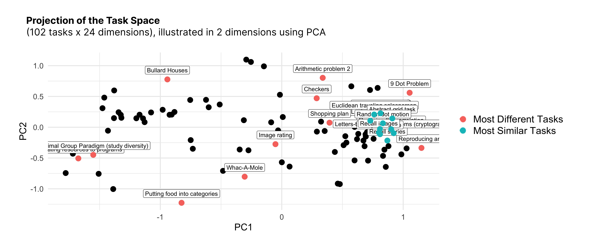

---
title: `r params$set_title`
---

```{r include=FALSE}
# TODO --- this whole website needs to be updated before we finalize the replication package!!

# Note to self for things to improve in this writeup
# - Link to full paper (once complete)
# - Easier, cleaner mechanism of selecting tasks (perhaps a Python library or just clean up the code?)
# - Better method of adding tasks to the repository
```
A digital companion for our (forthcoming) paper, "Tasks Beyond Taxonomies: A Multidimensional Design Space for Team Tasks."

## Read our Preprint!
Our paper is currently under review at _Management Science_. The latest version of our paper preprint can be found at the following PsyArXiv link:
https://osf.io/preprints/psyarxiv/543sz

### Data and Code
Our data and code are also publicly available: https://osf.io/4pftv/

## Tasks play an enormous, often underestimated, role in team behavior.  
Teams that excel in one task --- such as solving math puzzles --- may not necessarily perform well on another (such as writing short stories). Indeed, different tasks may require entirely different skills, approaches, and strategies; you wouldn't coach a soccer team the same way as you would a chess team!

These intuitions are backed by decades of research (Fleishman 1975; Herold 1978; Wood 1986; Stewart and Barrick 2000; Larson 2010; Whiting et al. 2019). According to Morris (1966), the type of task assigned to the group explained 60% of the communication variance. Understanding task characteristics has been called "a basic requirement" (Roby and Lanzetta 1958) and a "high-priority research need" (Hackman 1968).

But often, in social science, the task simply acts a backdrop to other theoretical questions. The researcher simply "'give[s] the subject a task to do' while some 'substantive' variables are being studied" (Hackman 1968) --- then, based on the results, researchers use intuition to generalize the findings to other settings. However, the specific features of tasks, and how they might influence the results of experiments, are rarely quantified or analyzed in detail.

In fact, **the tools to analyze the impact of task features have not previously existed.** The best way to describe a task has, historically, been using frameworks that place tasks into conceptual categories, such as "creative tasks" (e.g. McGrath 1984) or "maximizing tasks" (e.g., Steiner 1972). The problem is that these frameworks have incompatible underlying assumptions, and so different ways of grouping tasks are not comparable to one another. Additionally, using these conceptual categories places the onus on the researcher to make subjective judgments, which can vary from person to person --- particularly because terms within task frameworks are not always operationally well-defined.

## We quantify task features, so that researchers can use them to sample tasks intelligently and build task-sensitive theories.

We allow researchers to answer the question, "how might the features of the task I am using affect the generalizability of my results?" and, "how can I design future experiments to ensure that my findings are as generalizable as possible?"

Specifically, we define a "design space" of tasks (the Task Space), shown in the figure below. By quantifying the features of **102 tasks** across **24 dimensions**, each on a 0-1 scale, researchers can use task features to intelligently select tasks (ensuring, for example, that the tasks used in a study are as diverse as possible), as well as include task features in empirical analysis, such as mediation, moderation, meta-analysis, and more.


The process by which we quantify these features is described in more detail in our (forthcoming) paper --- stay tuned!

```{r setup, include=FALSE}
knitr::opts_chunk$set(echo = TRUE)

library(ggplot2)
library(e1071)
library(plotly)
library(dplyr)
library(tidyverse)
```

A more user-friendly version of the Task Space is to project it into two dimensions using PCA --- producing a "map" of tasks, or the Task Map. To familiarize yourself with the Task Map, please feel free to play with the interactive visualizer below. You can choose different values of *k*, and the visualizer will conduct k-means clustering on the full, underlying 24-dimensional space. You can mouse over each dot to see the name of the task.

```{r echo=F, out.width="100%"}
knitr::include_app("https://xehu.shinyapps.io/interactive-task-map/")
```

## Using the Task Map

### Select Tasks
One way the Task Map can potentially help you is by making it easier for you to select tasks for experiments. Rather than arbitrarily choosing tasks for experiments, the Task Map makes it possible to define specific algorithms for task selection, which can then be reproduced easily by other researchers.

These include:

- **Selecting Maximally Different (Diverse) Tasks.** The researcher may wish to cast the net as wide as possible, choosing tasks that represent a diverse array of activities (i.e., that maximizes the within-group difference of the chosen tasks, and thus makes it more likely that a finding will generalize across many activities). Such a set of tasks is shown in in the figure below by the red points.

- **Selecting Minimally Different (Similar) Tasks.** hk_f18a61939eed6861, a researcher may be interested in a cluster of tasks with similar properties. Perhaps they are concerned about a specific phenomenon — for example, memory — and wish to select only tasks from a limited region in the Task Space (e.g., Recall Images, Recall Words, and Recall Stories). Such a set of tasks is shown in the figure below by the blue points.

- **Adaptive Sampling.** The researcher may not wish to pre-select all tasks, and may instead opt for an adaptive approach in which each subsequent task is chosen based on the results of the previous task. Here, they can use an active learning algorithm (for example, Bayesian optimization). Using an uncertainty sampling approach, the algorithm might identify a region of tasks about which it currently has the least information and suggest subsequent experiments to reduce its uncertainty. The researcher would thus progressively gain more knowledge by repeatedly prodding at their theory’s boundary conditions.

#### Sample Code for Sampling Tasks
The red and blue tasks in the figure below were generated by [this Python notebook](https://github.com/Watts-Lab/task-mapping/blob/master/analysis/choose-10-tasks.ipynb), which you can use as a starting point for selecting tasks. More generally, you can download the Task Space and implementing any selection algorithm that works for you.



### Build Models

Another way the Task Map can potentially help you is by providing you with quantified task features, which can be used in data analysis. You could, for example, statistically "control for" task features by including the feature columns in any other statistical model you are building. hk_f18a61939eed6861, you may be interested in comparing and contrasting results across multiple different tasks, and building a "task-sensitive theory" for how behaviors shift as the task context shifts. Below is an example of such a task-sensitive theory, in which the researcher fits a Support Vector Machine (SVM) to hypothetical data measuring the team outcome of "synergy." After fitting the model on the Task Space, the researche can hypothesize that they will observe synergy for teams completing tasks in the blue region, but will not observe synergy for teams completing tasks in the red region.

![A Support Vector Machine, trained on all 24 task dimensions, can be used to predict a team outcome (for example, whether teams display "synergy" or not) for a given task. (Here, the synergy labels are synthetic, while the task points are real.) The green points with white labels represent 10 tasks used in the researcher’s experiment. For these 10 tasks, teams displayed synergy for some (synergy = 1, represented by a triangle), and did not display synergy for others (synergy = 0, represented by a circle). The SVM predicts that teams performing tasks in the blue region will display synergy, while teams performing tasks in the red region will not display synergy. The lower panel shows the top 10 weights for the SVM. Tasks in the positive class tend to have greater weight in the Mixed-Motive, Conflicting Tradeoffs, Solution Scheme Outcome Uncertainty, Cognitive Conflict, and Generate dimensions. Tasks in the negative class tend to have greater weight in the Outcome Multiplicity, Objective Correctness, Optimizing, Decision Verifiability, and Divisible-Unitary dimensions.](task_svm_sample.png)

The underlying support vector machine used for this example was generated using [this Python notebook](https://osf.io/9ks4z).

### Download the Data
You can use the Task Space today, by downloading it here: [`task_map.csv`](https://osf.io/q3tx2). This data is updated periodically with new tasks, ratings, and columns, as appropriate.

For additional details, please refer to our OSF Page (https://osf.io/4pftv/).

### Contribute your own tasks / dimensions!
We welcome efforts to continue expanding our Task Space. At present, please contact the Corresponding Author, **Xinlan Emily Hu**, at **<xehu> @ wharton (dot) upenn (dot) edu**.

## About Us
It takes a team to study teams. Our main research team at the Computational Social Science Lab consists of:

- [Xinlan Emily Hu](https://xinlanemilyhu.com) (Corresponding Author)
- [Linnea Gandhi](https://oid.wharton.upenn.edu/profile/lgandhi/#research)
- [Mark Whiting](https://whiting.me/)
- [Duncan J. Watts](https://duncanjwatts.com/)
- [Abdullah Almaatouq](http://amaatouq.io/)

This work was also created with the support from numerous others, including many research assistants at the University of Pennsylvania, as well as the with labor of Amazon Mechanical Turk workers. 

This project is part of the [group dynamics research](https://css.seas.upenn.edu/project/group-dynamics/) at the [Computational Social Science Lab at Penn](https://css.seas.upenn.edu). You can learn more about our lab [here](https://css.seas.upenn.edu/people/). 
