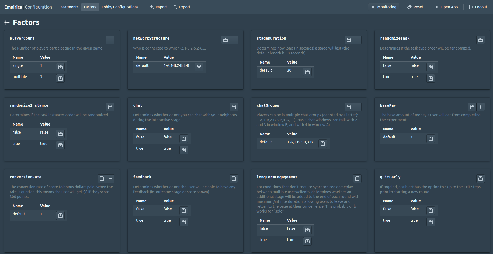

# Multi Task App

_This project was generated with [create-empirica-app](https://github.com/empiricaly/create-empirica-app)._

_Add a description of your Empirica app_

# Running this App Locally

## Docker

Prerequisites:

- Install the [latest version of Docker](https://docs.docker.com/get-docker/).

Note that `docker compose` and `docker-compose` are functionally identical, but `docker compose` is a newer project to migrate compose to Go and shift off of Python as a dependency. If the command is available to you, then it is best to use `docker compose`. See more [here](https://stackoverflow.com/a/66516826/20226488).

Instructions for developing with the Docker environment:

1. Ensure you are in the root directory of the repository: `multi-task-empirica`, not `multi-task-empirica/multi-task-app`.
2. Run `docker compose up -d` to spin up the Docker services in _detached_ mode.
3. Run `docker compose exec mte-app bash` to attach to the `mte-app` service and execute the `bash` command. This will give you a terminal to run Meteor and other CLI commands from within the container. The command can be run in multiple terminals.
4. On first time spin up, run `meteor npm install` as usual. Optionally precede with `meteor reset` to reset the meteor project.
5. Spin down the service with `docker compose down`.

**Note: It may take several minutes during the first run, due to image build size. Also, if `meteor` or `meteor run` fails with `Killed`, it likely means that the container OOM Killer ended the process due to memory constraints. Since Meteor builds are incremental, the current workaround is to simply run `meteor` or `meteor run` again. A more long term solution is a WIP.**

## General Setup

If you haven't already:

- Install `Node.js` and `npm` here: [https://nodejs.org/en/](https://nodejs.org/en/)
- Install `Meteor` here: [https://www.meteor.com/install](https://www.meteor.com/install)

## Preparing this app

If you have just downloaded, pulled, or cloned this app, you should run this in the command line to install all the Node packages:

```
meteor npm install
```

NOTE: If you encounter a `SyntaxError: Unexpected enf of JSON` error, run the following command:

```
rm -rf ./node_modules/resolve/test/resolver/malformed_package_json/
```

## Launching the app

You can now run the app on your local machine with:

```
meteor
```

This can take a few minutes.

This will start the app that you can access as a participant:
[https:/localhost:3000/](https:/localhost:3000/)

You can access the admin panel here:
[https:/localhost:3000/admin](https:/localhost:3000/admin)

Log in with the _username_ and _password_ provided in the command line.

## Loading the factors and treatments

To use the app, you usually need to use treatments and factors. Some might be prepared in a `.yaml` file (e.g., `factors.yaml`). In the **admin panel**:

- click on the **Configuration** button
- click on **import**
- select the `.yaml` file you want to import the factors and treatments from
- wait a few seconds for the factors and treatments to be imported

## Testing the app

To run a game create a new `batch` with the games of treatments you want to use and click start on the batch.

Open a player tab by going to [https:/localhost:3000/](https:/localhost:3000/) or clicking on **open app**.

The player that you open with [https:/localhost:3000/](https:/localhost:3000/) is cached on your browser. Whenever you start a game with this player, your local app will keep that information. To play again there are multiple things you can do:

- Click on the **Reset current session** button on the header of a tab with your player to reset this player, and create a new game for this player to join.
- Click on the **New Player** button on the header of a tab with your player to open a new tab with a different player (you will see the id of that player in the title of the tab).
- Go to the **Players** tab in the admin panel and retire players that have finished or cancelled.

**The app will hot reload as you save changes to your code.**

# Structure of the App

```
├── client
│   ├── common
|   |   ├── avatars.js
|   |   ├── Overview.js
│   |   ├── chat
│   |   |   └── ChatContainer.jsx
│   |   ├── components
|   |   |   ├── Quiz.js
│   |   |   ├── Button.jsx
│   |   |   ├── ConfirmBox.jsx
│   |   |   ├── Timer.jsx
│   |   |   ├── Toast.jsx
│   |   |   └── Wrapper.jsx
│   |   ├── PlayerProfile.jsx
│   |   └── Round.jsx
│   ├── exit // common components separated by game state
│   |   ├── ExitSurvey.jsx
│   |   ├── Sorry.jsx
│   |   └── Thanks.jsx
│   ├── game
│   |   ├── About.jsx [REMOVED]
│   |   ├── Task.jsx // entry points for tasks
│   |   └── Wait.jsx
│   ├── intro // common components separated by game state
│   |   ├── Consent.jsx
│   |   ├── NewPlayer.jsx
│   |   └── Overview.jsx
|   ├── main.html
|   ├── main.js
|   └── main.less
├── server
│   ├── callbacks.js
│   └── main.js
├── public
├── customTasks // shared between server and client
|   ├── TaskNameOne
│   |   ├── outro
│   │   |   ├── index.jsx
│   │   |   └── // task specific
│   |   ├── game
│   │   |   ├── index.jsx
│   │   |   └── // task specific
│   |   ├── intro
│   │   |   ├── index.jsx
│   │   |   └── // task specific
│   |   ├── callbacks.jsx
│   │   └── constants.jsx
|   ├── TaskNameTwo
│   |   ├── outro
│   │   |   ├── index.jsx
│   │   |   └── // task specific
│   |   ├── game
│   │   |   ├── index.jsx
│   │   |   └── // task specific
│   |   ├── intro
│   │   |   ├── index.jsx
│   │   |   └── // task specific
│   |   ├── callbacks.jsx
│   │   └── constants.jsx
|   ├── gameConfiguration.jsx
|   ├── helpers.js // functions used to help build game configuration eg. Fisher-Yates Algo for shuffling
└── └── taskWhiteList.js // list all file paths for tasks here
```

## How To Add A New Game - Research Assistant

#### Clone repo into the `tasks` directory

```
$ cd app-name/client/tasks
$ git clone <app_repo>
```

#### Add path to `customTasks/taskWhiteList.jsx`

eg:

```javascript
export default function taskWhiteList() {
  if (false) {
    // example of new task
    import("../customTasks/TaskNameOne/game");
    import("../customTasks/TaskNameOne/intro");
    import("../customTasks/TaskNameOne/outro");
    import("../customTasks/TaskNameOne/callbacks");
    import("../customTasks/TaskNameOne/constants");
    // example of new task
    import("../customTasks/TaskNameTwo/game");
    import("../customTasks/TaskNameTwo/intro");
    import("../customTasks/TaskNameTwo/outro");
    import("../customTasks/TaskNameTwo/callbacks");
    import("../customTasks/TaskNameTwo/constants");
  }
}
```

## Game Config - Admin

The gameConfiguration file lives at the root of the `tasks` directory and exports the `GameConfiguration` object used to create the game structure.

Below is an example game configuration.

- `task_class`: The name of the game directory. This will always be CamelCase.
- `humanize`: How the end user will read the title of the game
- `instances`: This is a list of the variations of the task that will be played. Below for Snake, there will be three instances of the task played. If RandomizeTask is true in the game treatment, then the tasks order will be randomly chosen. If RandomizeInstance is true in the game treatment, then the instance order will be randomly chosen.
- `intro`: If the task supports by having a subdirectory called `intro` and if set to `true`, there will be intro steps before user reaches the task.
- `outro`: If the task supports by having a subdirectory called `outro` there will be outro steps before the user reaches the task.

**Important Notes:**

- Please edit above the line `//DO NOT TOUCH THIS CODE`, what falls below syncs each task's callbacks and constants files with the global callbacks and can interfere with the game.

eg:

```javascript
export const GameConfiguration = [
  {
    task_class: "Snake",
    humanize: "Snake",
    instances: [0, 1, 2],
    intro: true,
    outro: true,
  },
  {
    task_class: "RoomAssignment",
    humanize: "Assign Users to Rooms",
    instances: [0, 1, 2, 4],
    intro: false,
    outro: false,
  },
];
```

example instances:

```javascript
// constants.jsx at the root of each task directory
// parameters of the task instances
const N_DOTS = 50;
const DOT_SPEED = 120;
const DIFF_LVLS = { bad: 0.08, good: 0.4 };

export const TASK_INSTANCES = [
  {
    _id: 0,
    correctAnswer: 1.8326,
    answerProportion: DIFF_LVLS,
    dotSpeed: DOT_SPEED,
    nDots: N_DOTS,
  },
  {
    _id: 1,
    correctAnswer: 2.0944,
    answerProportion: DIFF_LVLS,
    dotSpeed: DOT_SPEED,
    nDots: N_DOTS,
  },
  {
    _id: 2,
    correctAnswer: 2.3038,
    answerProportion: DIFF_LVLS,
    dotSpeed: DOT_SPEED,
    nDots: N_DOTS,
  },
  {
    _id: 3,
    correctAnswer: 2.5656,
    answerProportion: DIFF_LVLS,
    dotSpeed: DOT_SPEED,
    nDots: N_DOTS,
  },
  {
    _id: 4,
    correctAnswer: 2.8274,
    answerProportion: DIFF_LVLS,
    dotSpeed: DOT_SPEED,
    nDots: N_DOTS,
  },
];
```

## Game Treatment - Admin

### Required Factors for Full Functionality:

Implemented and shared across all tasks.

- `playerCount` : The Number of players participating in the given game. Allowed inputs are anything up to 20 players. eg. `3`
- `networkStructure` : Who is connected to who: eg. `1-2,1-3,2-5,2-6`
- `stageDuration`: Determines how long (in seconds) a stage will last (the default length is 30 seconds). eg. `30`
- `randomizeTask`: Determines if the task type order will be randomized. eg. `true` or `false`
- `randomizeInstance`: Determines if the task instances order will be randomized. eg. `true` or `false`
- `chat`: Determines whether or not you can chat with your neighbors during the interactive stage. eg. `true` or `false`
- `chatGroups`: Players can be in multiple chat groups (denoted by a letter): eg. `1-A,1-B,2-B,3-B,4-A`. (1 has 2 chat windows, can talk with 2 and 3 in window B, and with 4 in window A).
- `basePay`: The base amount of money a user will get from completing the experiment. eg. `10`
- `conversionRate`: The conversion rate of score to bonus dollars paid. When the rate is quarter, this means the user will get $8 if they score 300 points.
- `feedback`: Determines whether or not the user will be able to have any feedback (ie. outcome stage or score shown). eg. `true` or `false`
- `longTermEngagement`: Maintains synchronized ; determines whether an additional stage will be added to the end of each round with maximum/infinite duration, allowing users to leave and return to the page at their convenience. eg. `true` or `false`
- `quitEarly`: If toggled, a subject has the option to skip to the Exit Steps prior to starting a new round eg. `true` or `false`



## Client

All code in the `/client` directory will be ran on the client. The entry point
for your app on the client can be found in `/client/main.js`. In there you will
find more details about how to customize how a game _Round_ should be rendered,
what _Consent_ message and which _Intro Steps_ you want to present the players
with, etc.

The HTML root of you app in `/client/main.html` shouldn't generally be changed
much, other than to update the app's HTML `<head>`, which contains the app's
title, and possibly 3rd party JS and CSS imports.

All styling starts in `/client/main.less`, and is written in
[LESS](http://lesscss.org/), a simple superset of CSS. You can also add a plain
CSS files in `/client`.

The `/client/game`, `/client/intro`, `/client/exit` directories all contain
[React](https://reactjs.org/) components, which compose the UI of your app.
If you are new to React, we recommend you try out the official
[React Tutorial](https://reactjs.org/tutorial/tutorial.html).

## Server

Server-side code all starts in the `/server/main.js` file. In that file, we set
an important Empirica integration point, the `Empirica.gameInit`, which allows
to configure each game as they are initiated by Empirica.

From there we import 2 other files. First the `/server/callback.js` file, which
contains all the possible callbacks used in the lifecycle of a game. These
callbacks, such as `onRoundEnd`, offer powerful ways to add logic to a game in a
central point (the server), which is often preferable to adding all the logic on
the client.

Finally, the /server/bots.js file is where you can add bot definitions to your app.

## Public

The `/public` is here to host any static assets you might need in the game, such
as images. For example, if you add an image at `/public/my-logo.jpeg`, it will
be available in the app at `http://localhost:3000/my-logo.jpeg`.

# Learn more

- Empirica Website: [https://empirica.ly/](https://empirica.ly/)
- Empirica documentation: [https://docs.empirica.ly/](https://docs.empirica.ly/)
- Meteor Tutorial: [https://www.meteor.com/tutorials/react/creating-an-app](https://www.meteor.com/tutorials/react/creating-an-app)
- React Tutorial: [https://reactjs.org/tutorial/tutorial.html](https://reactjs.org/tutorial/tutorial.html)
- LESS Intro: [http://lesscss.org/#overview](http://lesscss.org/#overview)
- JavaScript Tutorial: [https://javascript.info/](https://javascript.info/)
